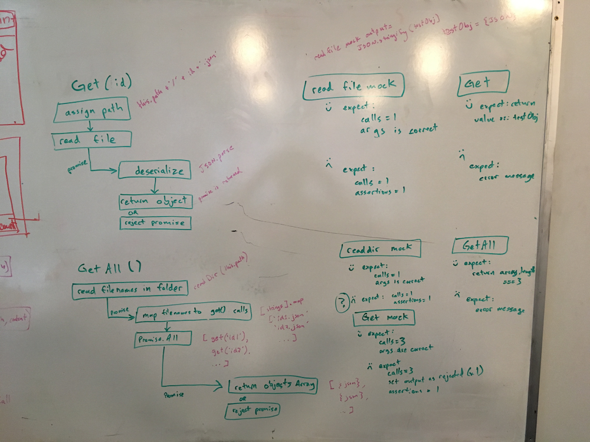

# lab-04

## Model and Database

### Author: Antonella Gutierrez

### Links and Resources

* [submission PR](https://github.com/antonella-401-advanced-javascript/lab-03/pull/1)
* [travis](https://travis-ci.com/antonella-401-advanced-javascript/lab-03)

### Documentation
* [jsdoc](/docs/) (Server assignments)

### Modules
##### Exported Values and Methods

##### Model Class and Manual Integration Testing
Use Model class to create a model, find by the id, and retrieve all models. create a schemaConfig and `Model` instance from that, export the created instance. Require `Database` and connect, import model instance(s), read and write using `create`, `findById`, and `find`.

### Setup
#### `.env` requirements
* `PORT` - Port Number

#### Running the app
* `npm start`
* Endpoint: `/`
    * Returns a boolean
* Endpoint: `/docs`
    * Returns JSDoc documentation pages

#### Tests
* Unit Tests: `npm test`
* Lint Tests: `npm run lint`

#### Whiteboard
